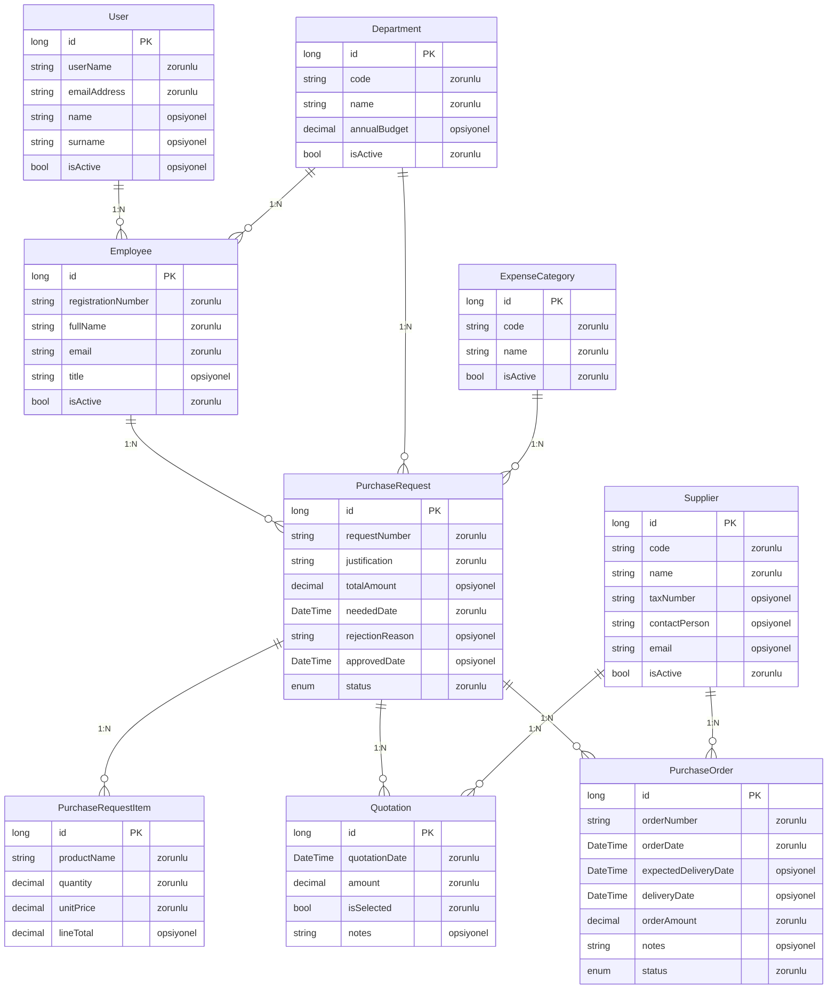
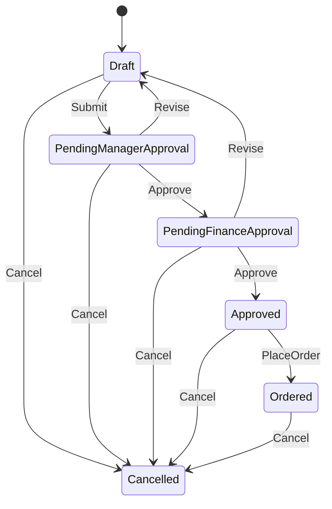
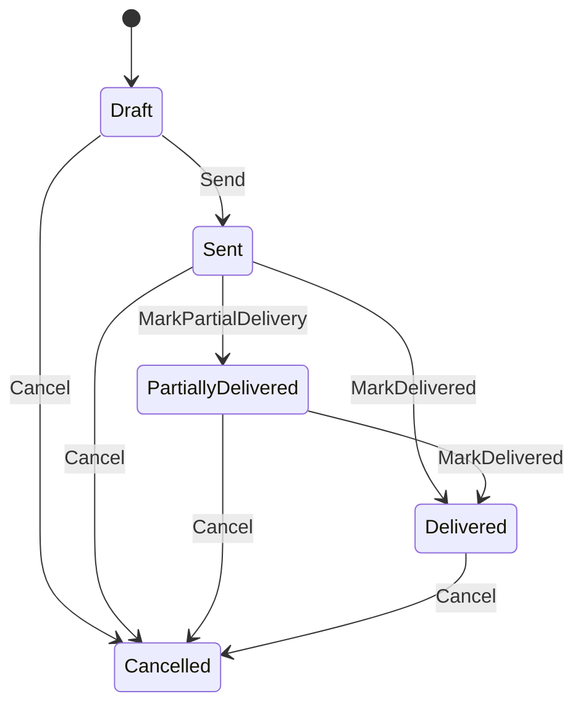
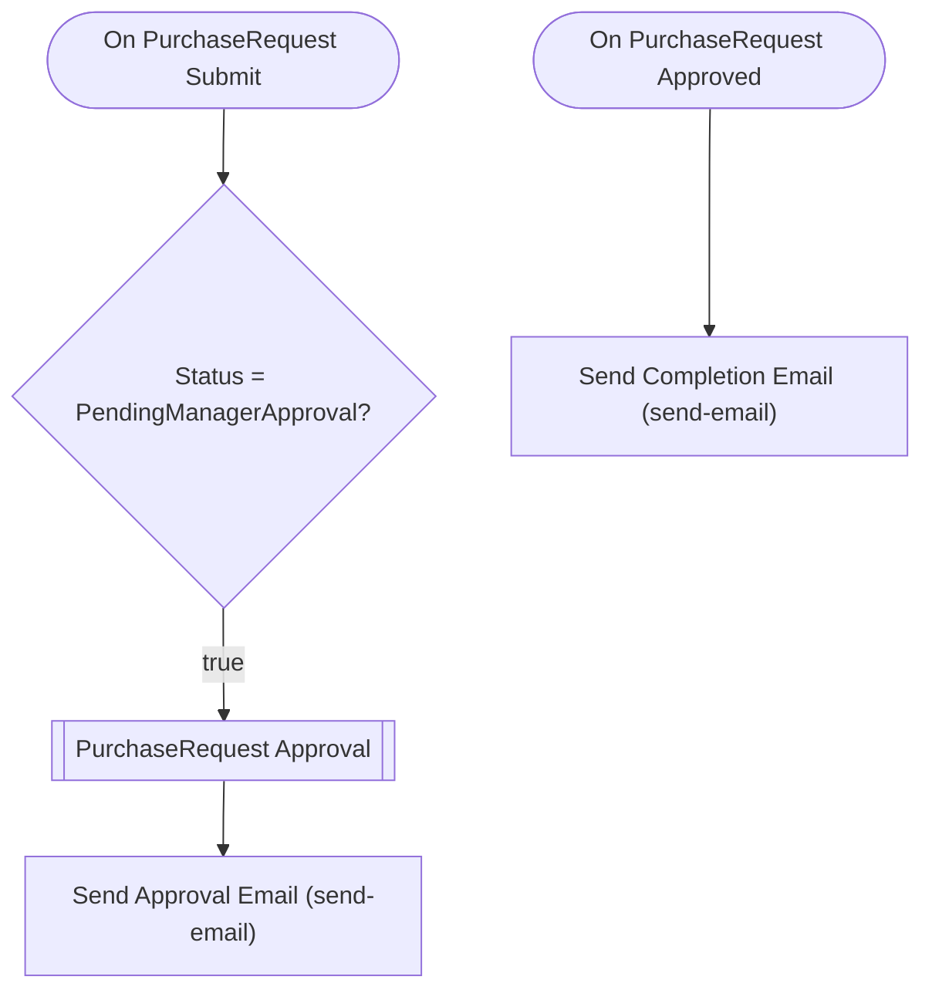

# director3 — Talep Analizi

> Bu belge Archipid talep olgunlaştırma (discovery) akışıyla üretildi.

## Orijinal Talep

Kurumsal bir "Satın Alma Talep ve Onay Yönetim Sistemi" istiyorum.

## Master data / parametre entity'leri:

- Department (Birim): birim kodu, birim adı, yıllık bütçe, aktif/pasif
- Employee (Personel): sicil numarası, ad soyad, e-posta, birim (Department
  ilişkili), unvan, aktif/pasif
- Supplier (Tedarikçi): tedarikçi kodu, tedarikçi adı, vergi numarası,
  iletişim kişisi, e-posta, aktif/pasif
- ExpenseCategory (Harcama Kalemi): kalem kodu, kalem adı (örn. BT Donanım,
  Danışmanlık, Sarf Malzeme), aktif/pasif

## Operasyonel entity'ler:

- PurchaseRequest (Satın Alma Talebi): talep numarası, talep eden (Employee
  ilişkili), talep eden birim (Department ilişkili), harcama kalemi
  (ExpenseCategory ilişkili), gerekçe, toplam tutar, ihtiyaç tarihi,
  red gerekçesi, durum
- PurchaseRequestItem (Talep Kalemi): talep (PurchaseRequest ilişkili),
  ürün/hizmet adı, miktar, birim fiyat, satır tutarı — bir talepte birden
  fazla kalem olabilir
- Quotation (Teklif): talep (PurchaseRequest ilişkili), tedarikçi (Supplier
  ilişkili), teklif tutarı, teklif tarihi, seçildi mi
- PurchaseOrder (Sipariş): talep (PurchaseRequest ilişkili), sipariş numarası,
  tedarikçi (Supplier ilişkili), sipariş tarihi, teslim tarihi, sipariş tutarı

Toplam 8 entity olsun, fazlasını ekleme.

## RBAC rolleri:

Requester (Talep Eden), DepartmentManager (Birim Müdürü), FinanceApprover
(Finans Onaycısı), PurchasingOfficer (Satın Alma Sorumlusu) sistem rolleri olsun.

## Onay akışı (state machine) — PurchaseRequest için:

Draft → PendingManagerApproval → PendingFinanceApproval → Approved → Ordered

Onay adımları ROL bazlı olsun:

- PendingManagerApproval adımı DepartmentManager rolüne atansın.
- PendingFinanceApproval adımı FinanceApprover rolüne atansın.
- Approved → Ordered geçişini PurchasingOfficer rolü yapsın.
- Herhangi bir onaycı reddederse talep Draft'a geri dönsün (revizyon) ve
  red gerekçesi zorunlu olsun.

Kural: Draft'tan onaya göndermek için talebin en az bir PurchaseRequestItem
kaydı bulunsun.
Kural: Approved'dan Ordered'a geçmek için talebin seçilmiş en az bir Quotation
kaydı bulunsun.

## Dashboard:

- Onayımı bekleyen talep sayısı
- Durum bazında talep dağılımı
- Birim bazında talep tutarı dağılımı
- Ortalama onay süresi (gün) — talep tarihinden onay tarihine
- İhtiyaç tarihi geçmiş, hâlâ onaylanmamış talepler listesi

## Raporlar:

- Talep onay formu (PDF): talep bilgileri, kalemler, teklifler, onay geçmişi

## Özet

Bu uygulama, kurumun satın alma taleplerini uçtan uca dijital ortamda yönetir. Çalışanların satın alma ihtiyaçlarını sisteme girmesini, birim müdürü ve finans ekibinin bu talepleri sırayla onaylamasını, ardından satın alma sorumlusunun tedarikçi tekliflerini kayıt altına alıp siparişi oluşturmasını ve siparişin teslimat sürecini takip etmesini sağlar.

Herhangi bir çalışan yeni bir talep oluşturur ve ürün kalemlerini ekler; isterse teklif de girebilir. Ardından talebi onaya gönderir. Önce DepartmentManager rolündeki herhangi bir kullanıcı, sonra FinanceApprover rolündeki herhangi bir kullanıcı talebi inceler; ilk onaylayan işlemi ilerletir. Her iki onay tamamlanınca talep 'Onaylandı' statüsüne geçer. Herhangi bir onaycı reddederse talep, red gerekçesiyle birlikte oluşturana geri döner; düzenlenip yeniden onaya gönderilebilir. Son aşamada satın alma sorumlusu siparişi oluşturur ve teslimat durumunu (Gönderildi → Kısmen Teslim → Teslim Edildi) sistem üzerinden günceller.

## Kapsam

- (belirtilmedi)

## Kapsam Dışı

- (belirtilmedi)

## Açık Noktalar

- (belirtilmedi)

## Eksiklikler

- (belirtilmedi)

## Öneriler

- (belirtilmedi)

## Veri Modeli

### User — Kullanıcı (Sistem)

| Alan | Tip | Zorunlu | Uzunluk |
|---|---|---|---|
| `id` | long | Evet | — |
| `userName` | string | Evet | 64 |
| `emailAddress` | string | Evet | 256 |
| `name` | string | Hayır | 128 |
| `surname` | string | Hayır | 128 |
| `isActive` | bool | Hayır | — |

**Neye bağlı:** Employee (1:N, bu tablo "bir" tarafı)

### Department — Birim

| Alan | Tip | Zorunlu | Uzunluk |
|---|---|---|---|
| `id` | long | Evet | — |
| `code` | string | Evet | 20 |
| `name` | string | Evet | 200 |
| `annualBudget` | decimal | Hayır | — |
| `isActive` | bool | Evet | — |

**Neye bağlı:** Employee (1:N, bu tablo "bir" tarafı) · PurchaseRequest (1:N, bu tablo "bir" tarafı)

### Employee — Personel

| Alan | Tip | Zorunlu | Uzunluk |
|---|---|---|---|
| `id` | long | Evet | — |
| `registrationNumber` | string | Evet | 50 |
| `fullName` | string | Evet | 200 |
| `email` | string | Evet | 256 |
| `title` | string | Hayır | 100 |
| `isActive` | bool | Evet | — |

**Neye bağlı:** User (1:N, bu tablo "çok" tarafı) · Department (1:N, bu tablo "çok" tarafı) · PurchaseRequest (1:N, bu tablo "bir" tarafı)

### Supplier — Tedarikçi

| Alan | Tip | Zorunlu | Uzunluk |
|---|---|---|---|
| `id` | long | Evet | — |
| `code` | string | Evet | 20 |
| `name` | string | Evet | 200 |
| `taxNumber` | string | Hayır | 50 |
| `contactPerson` | string | Hayır | 200 |
| `email` | string | Hayır | 256 |
| `isActive` | bool | Evet | — |

**Neye bağlı:** Quotation (1:N, bu tablo "bir" tarafı) · PurchaseOrder (1:N, bu tablo "bir" tarafı)

### ExpenseCategory — Harcama Kalemi

| Alan | Tip | Zorunlu | Uzunluk |
|---|---|---|---|
| `id` | long | Evet | — |
| `code` | string | Evet | 20 |
| `name` | string | Evet | 200 |
| `isActive` | bool | Evet | — |

**Neye bağlı:** PurchaseRequest (1:N, bu tablo "bir" tarafı)

### PurchaseRequest — Satın Alma Talebi

| Alan | Tip | Zorunlu | Uzunluk |
|---|---|---|---|
| `id` | long | Evet | — |
| `requestNumber` | string | Evet | 50 |
| `justification` | string | Evet | 1000 |
| `totalAmount` | decimal | Hayır | — |
| `neededDate` | DateTime | Evet | — |
| `rejectionReason` | string | Hayır | 1000 |
| `approvedDate` | DateTime | Hayır | — |
| `status` | enum (Draft,PendingManagerApproval,PendingFinanceApproval,Approved,Ordered,Cancelled) | Evet | — |

**Neye bağlı:** Employee (1:N, bu tablo "çok" tarafı) · Department (1:N, bu tablo "çok" tarafı) · ExpenseCategory (1:N, bu tablo "çok" tarafı) · PurchaseRequestItem (1:N, bu tablo "bir" tarafı) · Quotation (1:N, bu tablo "bir" tarafı) · PurchaseOrder (1:N, bu tablo "bir" tarafı)

### PurchaseRequestItem — Talep Kalemi

| Alan | Tip | Zorunlu | Uzunluk |
|---|---|---|---|
| `id` | long | Evet | — |
| `productName` | string | Evet | 300 |
| `quantity` | decimal | Evet | — |
| `unitPrice` | decimal | Evet | — |
| `lineTotal` | decimal | Hayır | — |

**Neye bağlı:** PurchaseRequest (1:N, bu tablo "çok" tarafı)

### Quotation — Teklif

| Alan | Tip | Zorunlu | Uzunluk |
|---|---|---|---|
| `id` | long | Evet | — |
| `quotationDate` | DateTime | Evet | — |
| `amount` | decimal | Evet | — |
| `isSelected` | bool | Evet | — |
| `notes` | string | Hayır | 500 |

**Neye bağlı:** PurchaseRequest (1:N, bu tablo "çok" tarafı) · Supplier (1:N, bu tablo "çok" tarafı)

### PurchaseOrder — Sipariş

| Alan | Tip | Zorunlu | Uzunluk |
|---|---|---|---|
| `id` | long | Evet | — |
| `orderNumber` | string | Evet | 50 |
| `orderDate` | DateTime | Evet | — |
| `expectedDeliveryDate` | DateTime | Hayır | — |
| `deliveryDate` | DateTime | Hayır | — |
| `orderAmount` | decimal | Evet | — |
| `notes` | string | Hayır | 500 |
| `status` | enum (Draft,Sent,PartiallyDelivered,Delivered,Cancelled) | Evet | — |

**Neye bağlı:** PurchaseRequest (1:N, bu tablo "çok" tarafı) · Supplier (1:N, bu tablo "çok" tarafı)

## İş Akışları

### Satın Alma Talebi — durum makinesi

**Onay adımları**

| # | Adım | Atanan | Aksiyonlar | Zorunlu alanlar |
|---|---|---|---|---|
| 1 | Birim Müdürü Onayı | Rol: `DepartmentManager` | Onayla (approve), Reddet (revise) | `rejectionReason` |
| 2 | Finans Onayı | Rol: `FinanceApprover` | Onayla (approve), Reddet (revise) | `rejectionReason` |

Reddedilirse kayıt **`Draft`** durumuna döner.

### Sipariş — durum makinesi

### Akış: PurchaseRequest Approval Flow

Auto-generated approval flow for PurchaseRequest. Customize email templates and add conditions as needed.

## Elle Geliştirme Gerektirenler

Aşağıdaki maddeler senaryonun gereği ama üretilen koda yansımıyor — kod yazılması gerekir.

| Alan | İş | Neden | Geçici çözüm |
|---|---|---|---|
| entity | Toplam tutar ve satır tutarı otomatik hesaplanmıyor | Hesaplanan alan üretimi desteklenmiyor. lineTotal (miktar × birim fiyat) ve totalAmount (kalemlerin toplamı) formülle doldurulamaz. | lineTotal ve totalAmount alanları kullanıcı tarafından manuel girilir. PurchasingOfficer rolü veri bütünlüğünü kontrol eder. |
| flow | Sipariş oluşunca talebin durumu otomatik 'Ordered'a geçmiyor | Çapraz kayıt otomasyon akışı üretilemiyor. PurchaseOrder kaydı oluştuğunda PurchaseRequest.status alanı otomatik güncellenemiyor. | PurchasingOfficer, siparişi oluşturduktan sonra talebi manuel 'PlaceOrder' aksiyonu ile 'Ordered' durumuna alır. |
| entity | Talep numarası otomatik üretilmiyor | Sequence/otomatik numara üretimi desteklenmiyor. | requestNumber alanı kullanıcı tarafından manuel girilir. |
| entity | Sipariş numarası otomatik üretilmiyor | Sequence/otomatik numara üretimi desteklenmiyor. | orderNumber alanı PurchasingOfficer tarafından manuel girilir. |
| validation | Yalnızca bir teklifin 'seçili' işaretlenebilmesi kuralı uygulanamıyor | Alan bazlı iş kuralı/benzersizlik doğrulaması (aynı talebin Quotation listesinde tek isSelected=true olabilmesi) üretilemiyor. | Teklifi seçen kullanıcı seçimi manuel yönetir; çoklu seçim sistemde engellenmez. |
